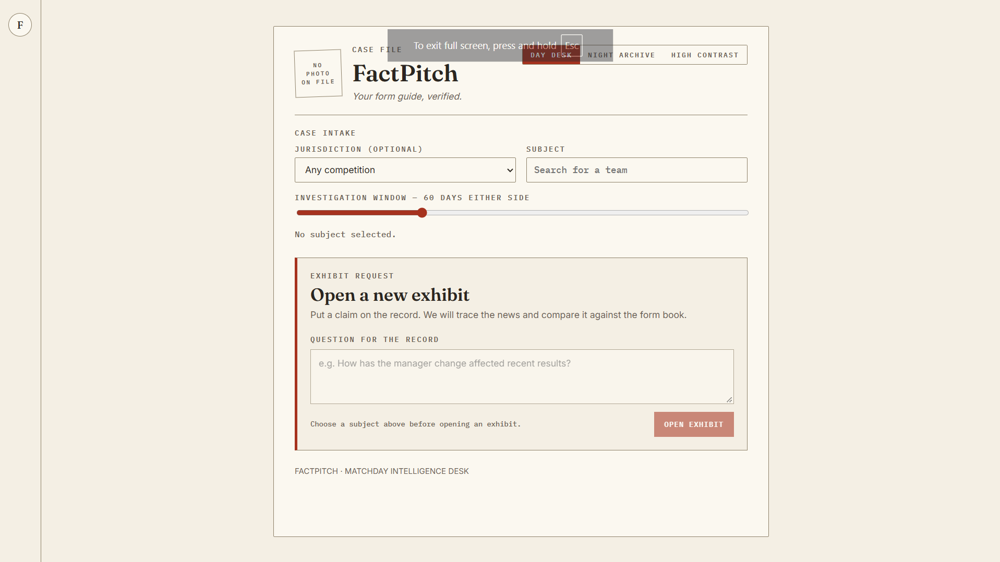
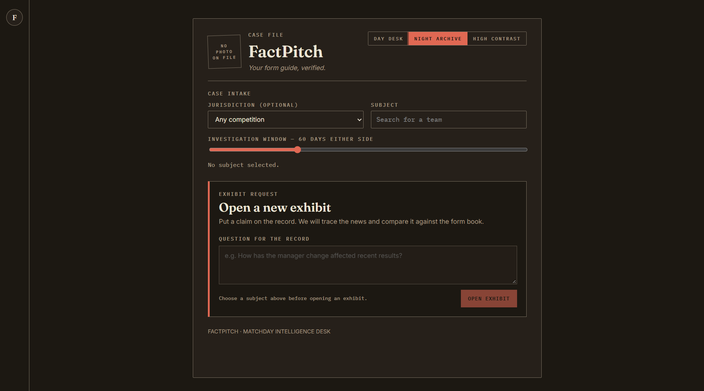
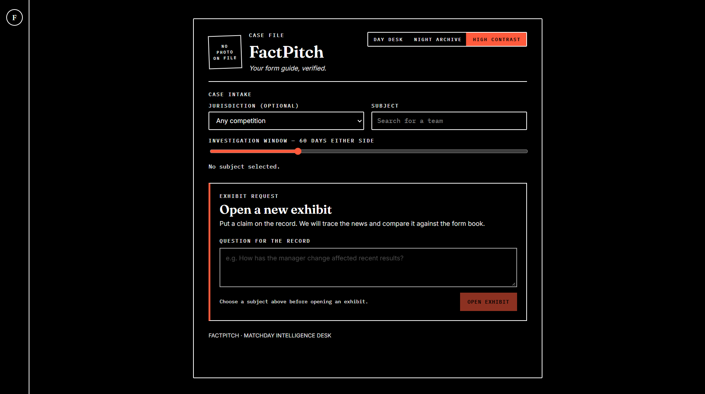
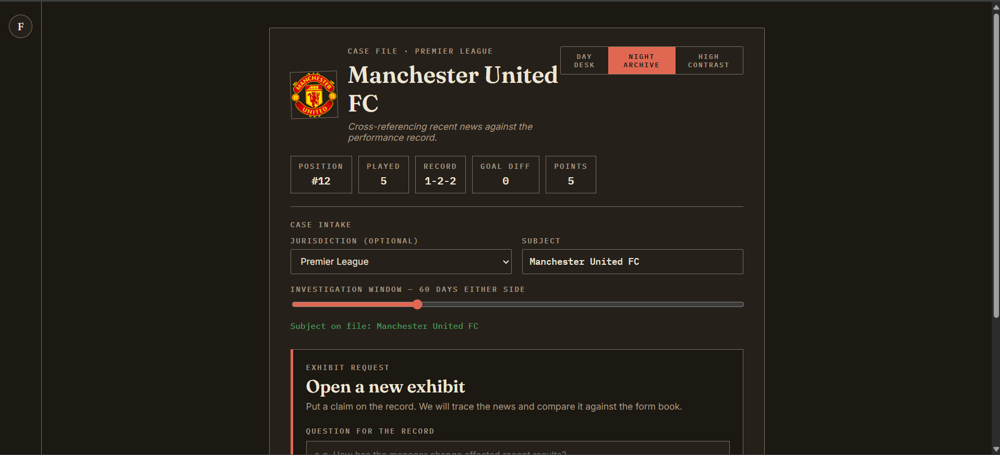
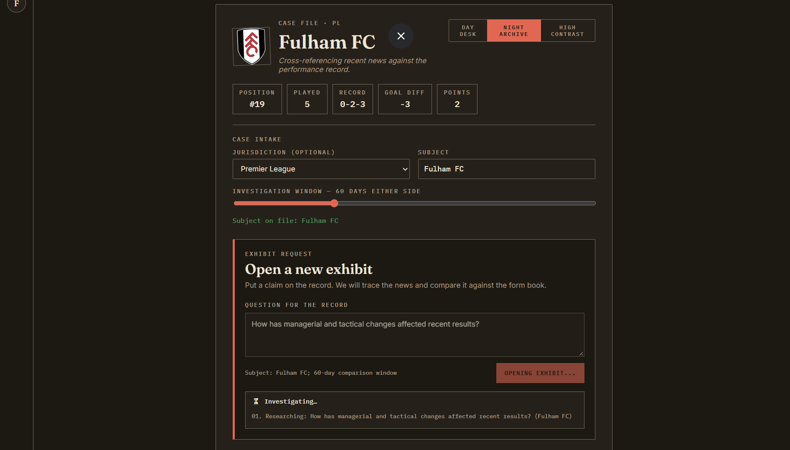
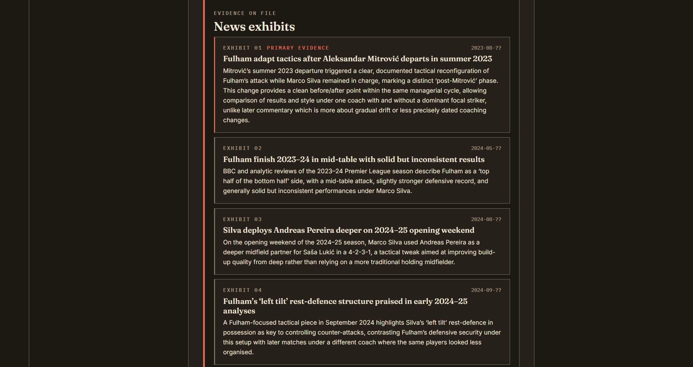
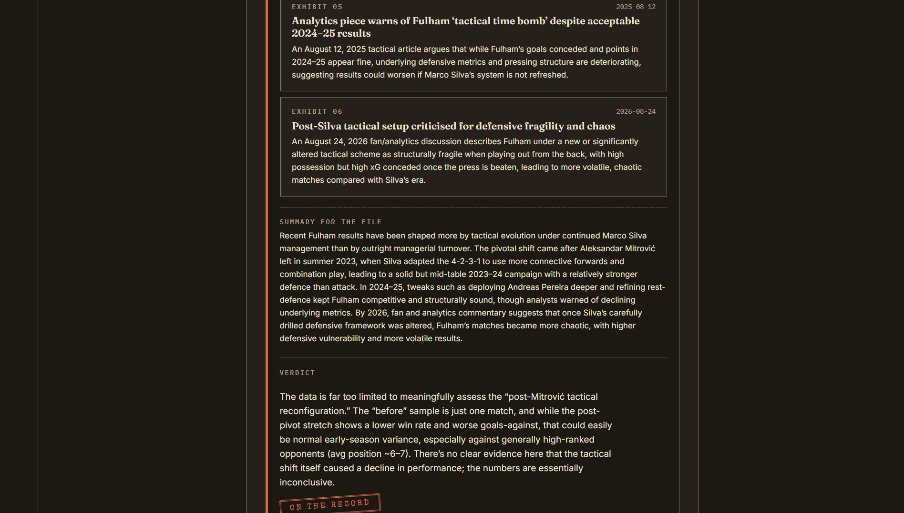
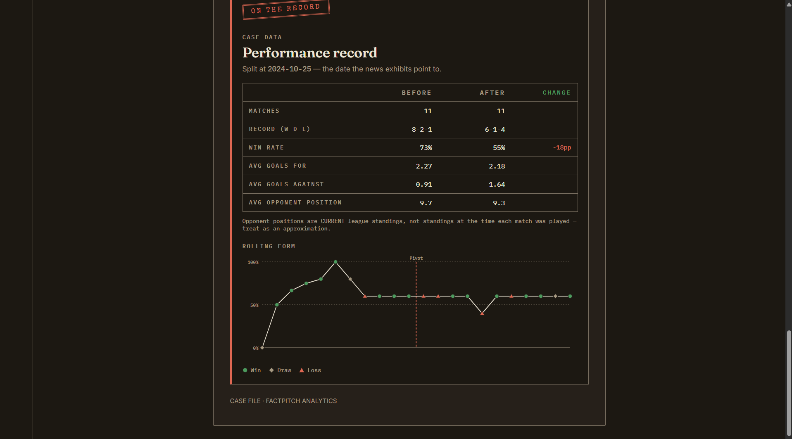
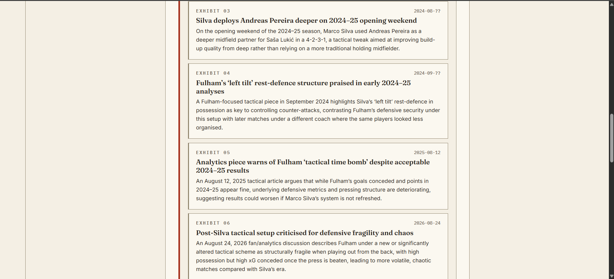
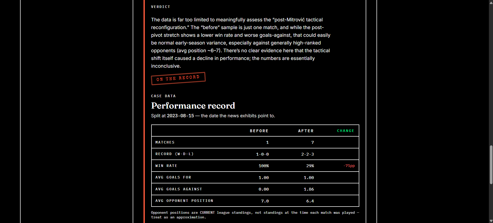

# FactPitch

**Your Form Guide, Verified.**

A personal project: an agent-based assistant that connects sports news (injuries, transfers, commentary) with what the underlying performance data actually shows.

## Design

**"Press-box dossier" visual direction** — the frontend treats an investigation like a physical case file rather than a generic sports dashboard. The interface uses a light paper-under-lamp aesthetic as its primary presentation, with a night-archive variant and a dedicated high-contrast mode.

The visual language is built around:

- **Paper-cream / charcoal / alarm-red palette** — paper and ink establish the document/case-file feel; the alarm red is deliberately reserved for important investigation states such as the verdict stamp, primary evidence, and the active action.
- **Fraunces** for display headlines and case-file titles, giving the dossier a distinctive editorial/document character.
- **Inter** for readable interface and body copy.
- **IBM Plex Mono** for dates, percentages, records, labels, and other tabular/technical values.
- **Special Elite** for the rubber-stamp verdict treatment.
- **Numbered exhibits** for news evidence, with the primary/pivot event visually distinguished.
- **File-photo framing** for the selected team's crest, with a letter fallback when a crest cannot be fetched.
- **Vitals chips** for current league position, record, goal difference, and points.
- **Ledger-style performance data** for before/after comparisons.
- **Dossier-style charts** for rolling form and result counts.
- **Three explicit themes** — Day Desk, Night Archive, and High Contrast — implemented through CSS custom properties on the document root.
- **Accessibility as part of the visual system**, including visible focus states, keyboard-navigable controls, semantic tabs/listboxes, reduced-motion handling, and contrast verification across all three themes.

Full design-token and rationale details live in `factpitch-frontend/src/theme.css`.

**The same Case Intake screen in all three themes:**

<table>
<tr>
<td></td>
<td></td>
<td></td>
</tr>
<tr>
<td align="center">Day Desk</td>
<td align="center">Night Archive</td>
<td align="center">High Contrast</td>
</tr>
</table>

## Architecture

**Orchestrator (`agents/orchestrator.py`)** — runs the pipeline end to end.

**Web-Researcher (`agents/web_researcher.py`)** — two-step: OpenAI's Responses API + built-in web search tool gathers raw research notes, then a LangChain-wrapped model extracts them into a validated `NewsResearch` schema (`agents/schemas.py`) via OpenAI's Structured Outputs API — no more manual JSON-fence-stripping or `try/except json.JSONDecodeError`.

**Data-Analyst (`agents/data_analyst.py`)** — pulls match data from football-data.org, computes before/after performance splits, attaches opponent-strength context (current league standing of each opponent faced), computes a trailing-5-match rolling win-rate series for the "Form Over Time" chart, and exposes `get_headline_stats()` (current league position, record, and goal difference from the standings table).

**Validator (`agents/validator.py`)** — checks whether the stats actually back up the news narrative, factoring in opponent strength where available.

The Orchestrator's `run()` accepts an optional `on_progress` callback, called with a short string at each pipeline stage. `main.py` doesn't use it (prints to console by default); the API's streaming endpoint uses it to drive live progress in the React UI.

## Two client surfaces

The project has one backend pipeline and two possible client surfaces:

- **FastAPI backend (`api/main.py`)** — the pipeline lives here.
- **React/Vite frontend (`factpitch-frontend/`)** — the browser client talks to the API exclusively over HTTP. It does not import agents, tools, or backend configuration directly.

### FastAPI backend

The API exposes:

- `GET /health`
- `GET /competitions`
- `GET /teams?competition=PL`
- `GET /teams/{id}/crest`
- `GET /teams/{id}/headline?competition=PL`
- `POST /analyze`
- `POST /analyze/stream` — Server-Sent Events with live per-stage progress

### React/Vite frontend

The frontend is a React + TypeScript application built with Vite. Its main responsibilities are presentation, interaction, API communication, and streamed progress rendering.

The frontend is organized around:

- `src/App.tsx` — application shell and top-level selection state.
- `src/components/CaseIntake.tsx` — competition/team selection and investigation-window controls.
- `src/components/CaseFileHeader.tsx` — selected-team crest, case-file identity, and current headline stats.
- `src/components/ExhibitOpener.tsx` — analysis query entry point and live investigation status.
- `src/components/NewsExhibits.tsx` — numbered news evidence and the primary/pivot event.
- `src/components/PerformanceRecord.tsx` — before/after performance ledger and rolling-form visualization.
- `src/components/charts/` — rolling-form and result-count charts.
- `src/components/Combobox.tsx` — searchable, keyboard-navigable team lookup.
- `src/components/ThemeToggle.tsx` and `src/context/ThemeContext.tsx` — Day Desk, Night Archive, and High Contrast themes.
- `src/services/apiClient.ts` — typed HTTP client for the FastAPI endpoints, including browser-side SSE parsing.
- `src/hooks/` — API-backed state and analysis lifecycle.
- `src/types/api.ts` — TypeScript representations of the backend API schemas.
- `src/theme.css` — design tokens, component styling, responsive behavior, and accessibility-related visual rules.

The old Streamlit surface has been removed from the client path. The React application is a pure HTTP client of the FastAPI API.

### Running the two processes

Both processes must be running for the frontend to work.

In one terminal:

```bash
uvicorn api.main:app --reload
```

In a second terminal:

```bash
cd factpitch-frontend
npm install
npm run dev
```

Vite will print the local development URL. The frontend defaults to:

```text
http://localhost:8000
```

for the API. To point it elsewhere, set `VITE_API_BASE_URL` before starting Vite:

```bash
VITE_API_BASE_URL=http://localhost:8000 npm run dev
```

The API URL is intentionally owned by the frontend HTTP client (`src/services/apiClient.ts`) rather than by individual components.

If the API cannot be reached, the frontend displays a clear records-office/API error and disables the selection controls instead of failing with an unhandled exception.

## Frontend interaction and design flow

The frontend is designed as a progressive case-file workflow rather than a dashboard full of controls.

### Phase 1 — Foundation

The first layer establishes the new visual language:

- paper-cream/charcoal/alarm-red tokens
- Day Desk, Night Archive, and High Contrast themes
- Fraunces, Inter, IBM Plex Mono, and Special Elite typography
- the centered case-file page shell
- the dossier/document surface and exhibit primitives

No analysis data is required to prove the shell.

### Phase 2 — Icon rail + case intake

The application shell introduces a restrained left-side identity rail and a **Case Intake** area.

Competition selection is presented as a document/jurisdiction field. Once a competition is selected, the searchable team combobox narrows the available subjects. The investigation window is controlled with a 15–180 day slider.

The frontend caches competition and team lookups in memory so switching back to an already-loaded selection does not unnecessarily repeat the request.

### Phase 3 — Case-file header

Once a team is selected, the case-file header becomes the subject record.

It can show:

- team crest, with a letter-badge fallback
- competition
- team name
- current league position
- matches played
- current W-D-L record
- goal difference
- points

The crest and headline statistics are fetched independently so supplementary hero data cannot prevent the rest of the interface from rendering.

These headline figures are current data fetched when the team is selected; they are not historical snapshots tied to the investigation window.



### Phase 4 — Query and Analyze flow

The investigation is opened as a new **exhibit request**.

The user enters a natural-language question, such as:

```text
How has the manager change affected recent results?
```

The frontend sends the request to `POST /analyze/stream` and consumes the Server-Sent Events stream using the browser's `fetch()` + `ReadableStream` APIs.

Progress is rendered as a live investigation log:

1. research
2. pivot selection
3. stats
4. validation

The UI keeps this streamed status visible without requiring the React components to know anything about the backend agent implementation.

The analysis hook also guards against stale in-flight requests so an older run cannot overwrite the result of a newer run.



### Phase 5 — Results

A completed analysis resolves into a dossier containing:

- **News exhibits** — each researched event becomes a numbered exhibit.
- **Primary evidence** — the event selected by the backend as the pivot is visually distinguished.
- **Case summary** — the researcher's overall summary is retained with the evidence.
- **Verdict stamp** — the Validator's conclusion is presented as the closing finding.
- **Performance record** — before/after statistics are presented as a ledger.
- **Rolling form** — the trailing-5-match win-rate series is plotted against the pivot date.
- **Result counts** — wins, draws, and losses are compared across the two periods.
- **Opponent-strength context** — average opponent league position is shown when standings coverage is available.

The frontend deliberately treats the verdict as a conclusion from the backend Validator rather than attempting to recreate the validation logic in the browser.







### Phase 6 — Accessibility and contrast verification

The final visual pass covers all three themes.

The frontend includes:

- keyboard navigation for the team combobox
- arrow-key navigation for result tabs
- semantic `role="combobox"`, `role="listbox"`, `role="option"`, and `role="tab"` behavior
- visible `:focus-visible` treatment
- `aria-live` status updates for the investigation log
- reduced-motion handling via `prefers-reduced-motion`
- high-contrast theme support
- borders and UI boundaries checked for sufficient contrast
- non-color cues for chart results so wins/draws/losses do not depend on color alone

The application also respects a user's stored theme preference and can detect OS-level light/dark and increased-contrast preferences on first load.

The same results content holds up across themes — Day Desk on the left, High Contrast on the right:

<table>
<tr>
<td></td>
<td></td>
</tr>
</table>

## A note on opponent strength

`avg_opponent_position` reflects each opponent's **current league standing**, not their standing at the time the match was actually played — the free-tier API doesn't expose historical standings snapshots.

It's a useful rough signal (e.g. "the after-period opponents were much higher-ranked, so a lower win rate isn't necessarily a real decline") but not a rigorous strength-of-schedule metric.

Cup/knockout matches (no league table) are automatically skipped and won't appear in the coverage count.

The same caveat applies to the hero section's headline metrics (league position, record, goal difference, and points) — they're the team's current standing, fetched fresh when a team is selected, not a snapshot tied to any particular query.

## Setup

### Create a virtual environment

```bash
python -m venv .venv
source .venv/bin/activate      # Windows: .venv\Scripts\activate
pip install -r requirements.txt
```

### Get your API keys

**OpenAI API key:**

```text
https://platform.openai.com/api-keys
```

**football-data.org free key:**

```text
https://www.football-data.org/client/register
```

Registration takes approximately two minutes. The free tier covers 12 major competitions and allows 10 requests/minute.

### Configure

```bash
cp .env.example .env
```

Then edit `.env` and paste in your keys.

Set your team/competition in `config.py`. To find a team's ID, call:

```bash
curl "https://api.football-data.org/v4/competitions/PL/teams" \
  -H "X-Auth-Token: YOUR_KEY"
```

and look up the `id` field for your team.

### Frontend configuration

The React/Vite frontend lives in `factpitch-frontend`.

Install its dependencies:

```bash
cd factpitch-frontend
npm install
```

Available frontend commands:

```bash
npm run dev
npm run build
npm run preview
npm run lint
npm test
```

For a production-style local preview:

```bash
npm run build
npm run preview
```

The frontend accepts the API base URL through `VITE_API_BASE_URL`. If omitted, it uses `http://localhost:8000`.

## Running it

### CLI

```bash
python main.py "Recent injury news for the captain"
```

By default this uses the team set in `config.py` (`DEFAULT_TEAM_ID` / `DEFAULT_TEAM_NAME`).

To point it at a different team without editing `config.py`, use `--team`:

```bash
python main.py --team "Liverpool FC" "Recent injury news for the captain"
```

`--team` does a name search across all 12 supported free-tier competitions (see `SUPPORTED_COMPETITIONS` in `config.py`) and caches each competition's team list for a week, so repeated lookups are fast and don't burn API calls.

If the name matches more than one distinct team, it'll print the candidates so you can narrow the result down — either with a more specific name, or by adding `--competition`:

```bash
python main.py --team "United" --competition PL "Recent news"
```

Combine with `--days` freely, in any order:

```bash
python main.py --team "Liverpool FC" --days 120 "Recent injury news"
```

### React/Vite UI

Start the API first:

```bash
uvicorn api.main:app --reload
```

Then, from a second terminal:

```bash
cd factpitch-frontend
npm run dev
```

Open the local URL printed by Vite.

The browser UI requires the FastAPI backend to be running. The frontend does not access the agents or data sources directly; all data and analysis requests go through the API.

## Running the tests

The project has a pytest suite covering the backend's trickiest logic — pivot-date selection, match/stats computation, team-name lookup and deduplication, cache/retry behavior, CLI flag parsing, the LangChain-backed news extraction, every FastAPI endpoint (including the SSE streaming one), and the API-side pipeline behavior.

The React/Vite frontend has its own Vitest + Testing Library suite covering:

- the API client and SSE parsing
- competition/team hooks and caching
- team combobox behavior and keyboard interaction
- case-file header and hero data
- case intake
- theme behavior
- streamed analysis state
- news exhibits and pivot-event rendering
- performance record and charts
- the application shell and result presentation

No real API keys or network access are required; external services are mocked in the test suites.

### Backend tests

```bash
pip install -r requirements-dev.txt
pytest -v
```

### Frontend tests

```bash
cd factpitch-frontend
npm test
```

For a watch mode while developing:

```bash
npm run test:watch
```

For the production frontend build:

```bash
npm run build
```

## Notes on the free tier

football-data.org's free tier only covers 12 competitions and has delayed (not live) scores — fine for this kind of historical/reflective analysis.

Responses are cached in `data/cache.db` for 6 hours to stay well within the 10 requests/minute limit.

The browser frontend adds a small in-memory cache for competition/team lookups during the current page session; this is separate from the backend's persistent response cache.

## Next steps / ideas to extend

- Swap the pivot-date logic to let you compare around any date (managerial change, transfer window close, etc.), not just injuries.
- Add a second data source for competitions outside the free 12 (e.g. API-Football) and merge results.
- Track your own prompting/debugging effort in `logs/` if you want to keep the "entropy" reflection habit from the group project.
- Add a persistent analysis history so completed case files can be reopened without rerunning the investigation.
- Add deep links for a selected competition/team/query so an investigation can be shared or revisited.
- Expand the dossier interaction model with printable/exportable case files.
